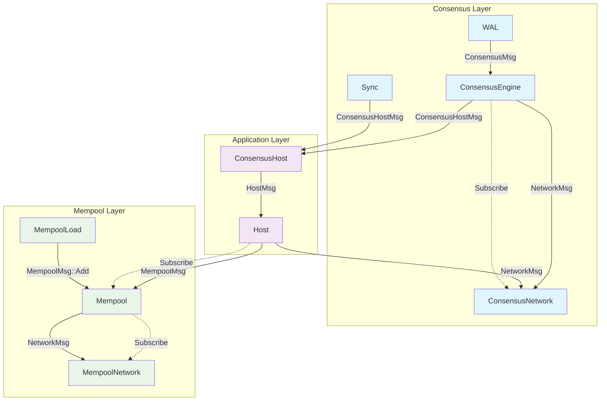
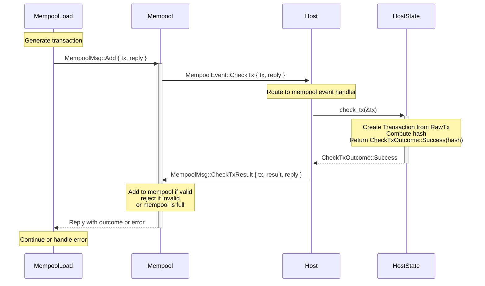
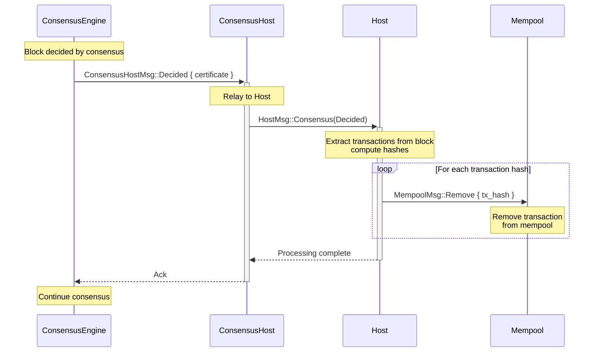

# Transaction Flow Diagram

## Actor Architecture

The application spawns the following actors with their respective ActorRef types and relationships:

### Actor Types:
- **Engine Actors** (blue): Core malachite engine components
- **App Actors** (purple): Custom application-specific actors
- **Network Actors** (green): Network and mempool infrastructure

### Key Relationships:
- `ConsensusHost` acts as a bridge between engine components and the custom `Host`
- `Host` handles both consensus messages and mempool events
- `MempoolLoad` generates transactions for testing/simulation
- All engine components (`Consensus`, `Sync`) communicate through `ConsensusHost`

## Transaction Flow Sequence

This diagram shows the flow for a valid transaction sent by `MempoolLoad`.
For transactions received via gossip layer, i.e. from `MempoolNetwork` the flow is the same, except there is no reply gossiped back to the network.

## Flow Description

1. **MempoolLoad** generates a transaction and sends it to the **Mempool** via `MempoolMsg::Add`
2. **Mempool** forwards the transaction directly to the **Host** via `MempoolEvent::CheckTx` 
3. **Host** routes the event to its mempool handler and calls **HostState**'s `check_tx` method
4. **HostState** creates a `Transaction` from the `RawTx`, computes its hash, and returns a `CheckTxOutcome::Success`
5. **Host** sends the result back to **Mempool** via `MempoolMsg::CheckTxResult`
6. **Mempool** adds the transaction to its pool if valid and space is available, rejects if invalid, or drops if the mempool is full, then replies to **MempoolLoad** with the outcome

## Transaction Removal Flow - Decided Block

This diagram shows how transactions are removed from the mempool when a block is decided by consensus.

## Removal Flow Description

1. **ConsensusEngine** decides on a block and sends `ConsensusHostMsg::Decided` with the certificate to **ConsensusHost**
2. **ConsensusHost** relays this as `HostMsg::Consensus(Decided)` to the **Host**
3. **Host** extracts the transaction hashes from the decided block's certificate
4. For each transaction hash, **Host** sends `MempoolMsg::Remove { tx_hash }` to **Mempool**
5. **Mempool** removes the corresponding transactions from its pool
6. **Host** completes processing and acknowledges back through **ConsensusHost**

## Key Points

- The `Host` actor serves as a bridge between the mempool and application state validation logic
- The `CheckTxOutcome` contains the transaction hash that will be used later for removal from the mempool
- Network transactions are processed in batches but validated individually through the same `CheckTx` flow
- Transactions can be dropped if the mempool is full, regardless of their origin (RPC or network gossip)
- Hash consistency between addition (`check_tx`) and removal (`Decided`) is critical for proper mempool management
- The same transaction hash computed during validation is used for removal when blocks are decided
